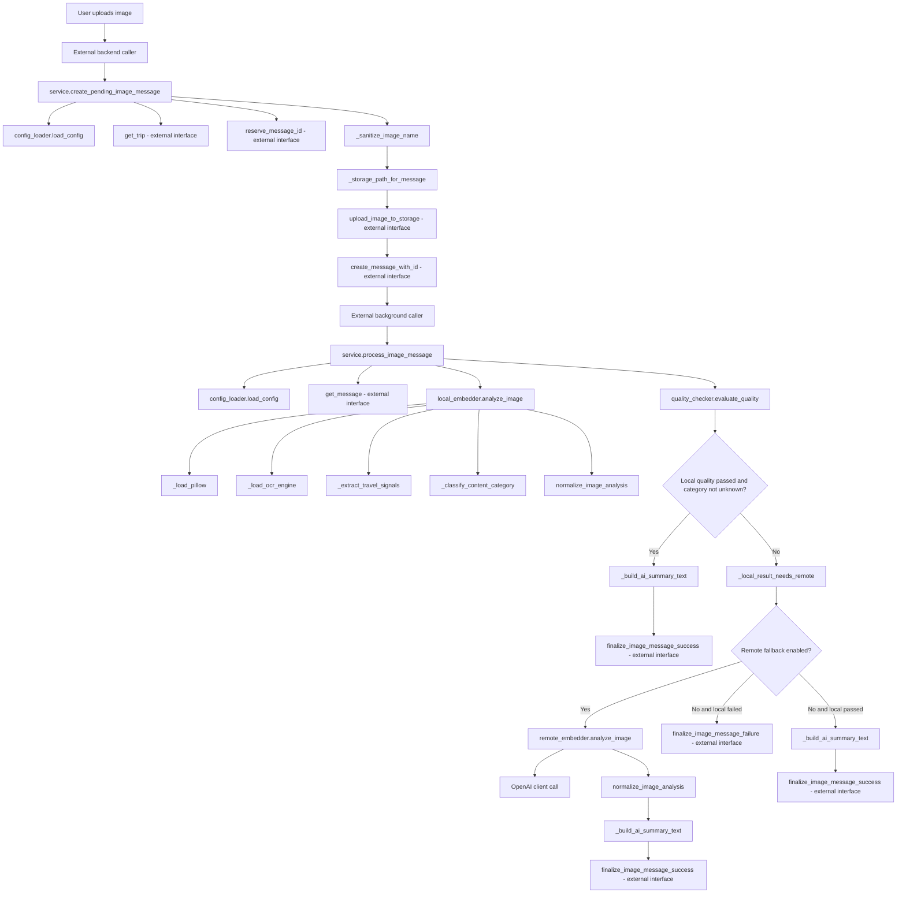
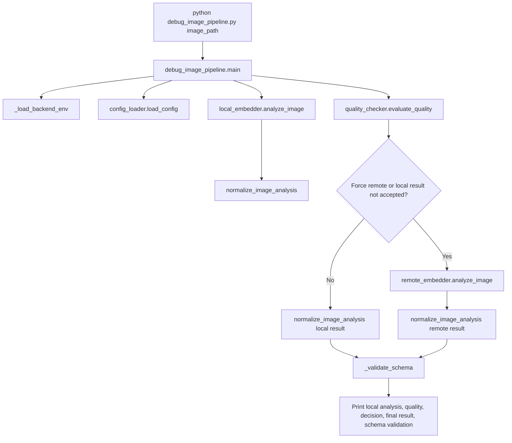

# Screenshot Processing Pipeline Summary

## Module Purpose

This package implements a screenshot/image analysis pipeline with:

- a shared normalized result schema
- a local OCR-first path
- a quality gate
- an optional remote OpenAI fallback
- a small service layer that coordinates upload-time processing and reply text generation

The directory name `image_embedding` is retained for compatibility, but the code here is for screenshot analysis rather than vector embeddings.

## Files and Responsibilities

- `__init__.py`
  - Defines shared schema helpers and constants.
  - Normalizes `travelSignals`.
  - Normalizes `contentCategory`.
  - Normalizes the final `imageAnalysis` payload.
  - Forces non-travel results to keep `travelSignals` empty.
- `config.yaml`
  - Active runtime configuration for feature flags, upload limits, local OCR behavior, quality thresholds, remote model settings, and reply formatting.
- `config_template.yaml`
  - Template version of the same config structure.
- `config_loader.py`
  - Loads and validates `config.yaml`.
  - Converts config sections into typed dataclasses.
  - Reads environment-backed values such as the storage bucket name and OpenAI API key.
  - Validates required runtime dependencies.
- `local_embedder.py`
  - Runs local image preprocessing with Pillow.
  - Runs OCR with `rapidocr_onnxruntime`.
  - Extracts text, confidence, and heuristic travel signals.
  - Classifies local content as `travel_related`, `non_travel_text`, or `unknown`.
  - Produces a normalized local result plus image metadata.
- `quality_checker.py`
  - Scores the local result using image dimensions, text length, OCR confidence, and detected signal count.
  - Decides whether the local result passes the quality gate.
- `remote_embedder.py`
  - Calls the OpenAI client with a strict JSON-only prompt.
  - Parses and normalizes the remote response.
  - Maps remote failures into categorized errors such as `auth`, `rate_limit`, `timeout`, `network_failure`, and `invalid_response`.
- `service.py`
  - Exposes the module entrypoints used by the rest of the backend.
  - Validates startup requirements.
  - Creates the initial pending image message payload.
  - Orchestrates local analysis, quality evaluation, optional remote fallback, and final reply text generation.
  - Depends on external Firebase/Firestore-style interfaces from `services.firebase`, but that implementation is outside this folder.
- `debug_image_pipeline.py`
  - Standalone CLI for manually testing the local-first pipeline without chat routes or Firebase/Firestore wiring.
  - Prints the local result, quality result, routing decision, final result, and schema validation.

## Processing Flow

### 1. Shared schema baseline

All branches normalize to the same top-level shape via `normalize_image_analysis(...)` in `__init__.py`.

That helper:

- coerces scalar fields into stable types
- normalizes `contentCategory`
- normalizes `travelSignals`
- clears `travelSignals` automatically when the category is not `travel_related`

### 2. Local OCR path

`local_embedder.analyze_image(...)`:

- loads the image with Pillow
- applies EXIF transpose
- converts to RGB and optionally grayscale
- resizes down to `local_ocr.max_dimension_px` when needed
- runs OCR with `RapidOCR`
- joins OCR lines into `extractedText`
- computes average OCR confidence
- extracts heuristic signals:
  - `locations`
  - `dates`
  - `prices`
  - `lodging`
  - `transport`
  - `bookingSignals`

It then classifies the content:

- `travel_related`
  - requires meaningful travel evidence from keyword-based signals and/or supporting indicators
- `non_travel_text`
  - used for text-heavy OCR results with little or no travel evidence
- `unknown`
  - used when OCR is weak or the content cannot be determined confidently

The local path does not attempt strong photo recognition, so it does not intentionally classify images as `non_travel_image`.

### 3. Quality evaluation

`quality_checker.evaluate_quality(...)` computes:

- `dimensions_score`
- `text_length_score`
- `confidence_score`
- `travel_signal_score`
- optional `keyword_bonus`

These are combined using `quality.weights` from config. The result passes only if:

- the weighted score meets `quality.pass_score`, and
- either:
  - signal count meets `quality.min_detected_signal_items`, or
  - text length and confidence both meet their minimum thresholds

The function returns:

- `passed`
- `quality_score`
- `factors` with width, height, text length, average confidence, and signal count

### 4. Remote fallback path

`remote_embedder.analyze_image(...)`:

- builds a data URL from the image bytes
- calls the OpenAI chat completions API
- requests `response_format={"type": "json_object"}`
- expects strict JSON matching the configured schema
- normalizes the result with `normalize_image_analysis(...)`

The remote prompt in config asks the model to:

- classify `contentCategory` first
- produce a category-appropriate summary
- only fill `travelSignals` for `travel_related`
- leave `travelSignals` as empty arrays for non-travel and unknown cases

This is the only branch in this folder that can produce `non_travel_image`.

### 5. Service orchestration

`service.process_image_message(...)` performs the folder-local orchestration:

- load config
- skip work if the current message is missing, not pending, already completed, or already has `analysisReplyMessageId`
- run local OCR
- run quality evaluation
- keep the local result if:
  - quality passed, and
  - `contentCategory` is not `unknown`
- call the remote branch if:
  - remote fallback is enabled, and
  - local quality failed or local evidence is still `unknown`
- finalize failure locally when remote fallback is disabled and local quality failed

If remote fallback is disabled but the local result passed quality, the local result is still accepted even if the category is `unknown`.

`service.create_pending_image_message(...)` also lives here. It validates MIME type and size, constructs a storage path, uploads through an external storage interface, and creates the initial pending payload. The storage and persistence implementation itself is outside this folder.

## Call-Order Diagrams

These diagrams only describe the code visible in this folder. The route handler, background task registration, and storage/database implementations are outside this folder, so they are shown only as external callers or external interfaces.

### Real backend path for a user-uploaded image



### Standalone debug path in this folder



### Function order summary

Normal service path inside this folder:

1. `service.create_pending_image_message(...)`
2. `config_loader.load_config()`
3. `_sanitize_image_name(...)`
4. `_storage_path_for_message(...)`
5. `service.process_image_message(...)`
6. `config_loader.load_config()`
7. `local_embedder.analyze_image(...)`
8. `quality_checker.evaluate_quality(...)`
9. `_local_result_needs_remote(...)`
10. Either:
    - `_build_ai_summary_text(...)` for local success
    - or `remote_embedder.analyze_image(...)` then `_build_ai_summary_text(...)`

Debug script path inside this folder:

1. `debug_image_pipeline.main()`
2. `_load_backend_env()`
3. `config_loader.load_config()`
4. `local_embedder.analyze_image(...)`
5. `quality_checker.evaluate_quality(...)`
6. Optional `remote_embedder.analyze_image(...)`
7. `_validate_schema(...)`

## Config and Environment Dependencies

### Config sections

`config_loader.py` expects these top-level config sections:

- `feature_flags`
- `storage`
- `upload`
- `local_ocr`
- `quality`
- `remote`
- `reply`

### Feature flags

- `feature_flags.screenshot_processing_enabled`
- `feature_flags.screenshot_remote_fallback_enabled`

### Environment-backed values

The config stores env var names, and `config_loader.py` resolves them at runtime:

- storage bucket via `storage.bucket_env_var`
- OpenAI API key via `remote.api_key_env_var`

### Dependency validation

`validate_runtime_configuration(...)` checks:

- `PIL` and `rapidocr_onnxruntime` when screenshot processing is enabled
- `openai` when remote fallback is enabled

`debug_image_pipeline.py` also imports `python-dotenv` and loads `adov/backend/.env` before config loading when run as a standalone script.

## Result Schema

The normalized result shape produced in this package is:

```json
{
  "processor": "local_ocr | openai_vision",
  "contentCategory": "travel_related | non_travel_text | non_travel_image | unknown",
  "summary": "string or null",
  "extractedText": "string or null",
  "confidence": "number or null",
  "qualityScore": "number or null",
  "travelSignals": {
    "locations": [],
    "dates": [],
    "prices": [],
    "lodging": [],
    "transport": [],
    "bookingSignals": []
  },
  "error": "string or null"
}
```

Notes:

- `travelSignals` is always present.
- For non-travel and unknown categories, `travelSignals` is normalized to empty arrays.
- `processor` is set by the branch that produced the final result:
  - `local_ocr`
  - `openai_vision`

## Local vs Remote Decision Logic

Inside this folder, the routing logic is:

- run local OCR first
- run the quality gate
- if local quality passes and category is not `unknown`, keep the local result
- otherwise, if remote fallback is enabled, call the remote embedder
- otherwise:
  - if local quality passed, keep the local result
  - if local quality failed, mark the result as a local failure with `error="quality_check_failed"`

This means remote fallback is driven by:

- local quality failure
- or insufficient local evidence (`contentCategory == "unknown"`)
- or explicit force-remote behavior in the debug CLI

Non-travel content does not automatically trigger remote fallback. A strong local `non_travel_text` result can stay local.

## Failure Behavior Inside This Module

### Local failures

If local processing raises unexpectedly in `service.process_image_message(...)`, the module creates a normalized failure result with:

- `processor="local_ocr"`
- `contentCategory="unknown"`
- empty `travelSignals`
- `error="local_processing_failure"`

### Remote failures

`remote_embedder.py` wraps OpenAI errors into `RemoteEmbedderError` with categorized `error_type` values:

- `auth`
- `rate_limit`
- `timeout`
- `network_failure`
- `invalid_response`

If remote fallback fails in `service.process_image_message(...)`, the module creates a normalized failure result with:

- `processor="openai_vision"`
- `contentCategory="unknown"`
- empty `travelSignals`
- `error=<remote error type>`

### Schema enforcement

`remote_embedder.py` validates that the normalized remote result has exactly these top-level keys:

- `processor`
- `contentCategory`
- `summary`
- `extractedText`
- `confidence`
- `qualityScore`
- `travelSignals`
- `error`

If the schema does not match after normalization, it raises `invalid_response`.

## Manual Debug Entrypoint in This Folder

### `debug_image_pipeline.py`

This is the only debug CLI currently present in this folder.

What it does:

- accepts a local `image_path`
- accepts optional `--mime-type`
- accepts optional `--force-remote`
- loads backend `.env`
- loads config with `load_config()`
- runs local analysis
- runs quality evaluation
- optionally runs the real remote embedder
- validates the final normalized schema

What it prints:

- `=== LOCAL ANALYSIS ===`
- `=== QUALITY CHECK ===`
- `=== PIPELINE DECISION ===`
- `=== FINAL RESULT ===`
- `=== SCHEMA VALIDATION ===`

Schema validation in the debug script checks:

- exact top-level keys
- exact `travelSignals` keys
- allowed `contentCategory` values
- empty travel signals for non-travel and unknown categories

The script exits with status code `1` if:

- the input file does not exist
- processing raises an exception
- final schema validation fails

## Notes and Limitations

- The package name is historical; it is not implementing vector embeddings.
- Local classification is heuristic and text-driven.
- The local branch does not try to do robust general image/photo recognition.
- `non_travel_image` is effectively expected from the remote branch, not the local OCR branch.
- `service.py` depends on external storage/persistence interfaces and does not define those implementations here.
- `config_template.yaml` starts with a comment telling the developer to rename it to `config.yaml`; this file is only a template and is not loaded automatically.
